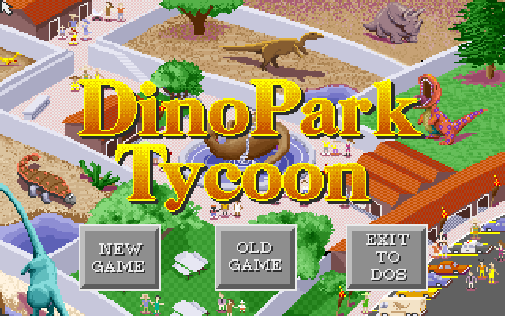
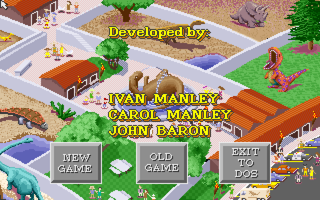
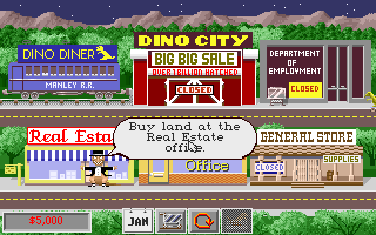
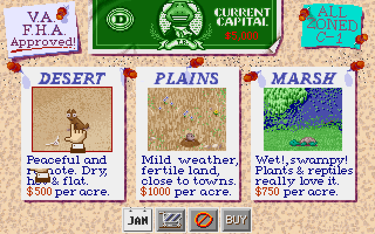
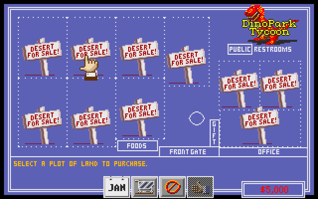
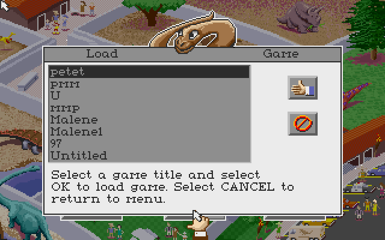

# DinoPark Tycoon Static Recompilation

Static recompilation of **DinoPark Tycoon** (1993, Manley & Associates / MECC)
from its 16-bit DOS binary to native C for Windows 11. `DINOPARK.EXE` is an
unpacked Borland C large-model program and holds all the game logic; this
project lifts every function in it to C and answers the DOS, VGA, keyboard,
mouse and Miles-audio services it expects with a small runtime.

No emulator. The 1993 machine code, translated once and compiled for a machine
that did not exist when it shipped.



*The title screen: the park animating behind the menu, the credits rolling over
it, and the logo — all drawn by the game's own code running natively.*

Built on the [pcrecomp](https://github.com/sp00nznet/pcrecomp) toolchain,
following the same DOS arc as civ (1991) and Bolo Adventures III (1993).

## Status

The game is playable. `work/dino_boot.exe` loads the original image, applies its
4,139 relocations, runs the real Borland startup, and reaches the game.

Working:

- **It plays.** New game, the bank approves your $5,000 loan, main street, the
  Real Estate office, choose a plot, buy it. The plot comes back marked SOLD and
  the money reads $4,500 — a $500 desert acre, the price the office quotes.
- **The intro runs** end to end: the MECC and Manley credits, the clapperboard,
  the comet, and the attract sequence over an animating park.
- **Graphics are correct**, including unchained Mode X — four planes, the Map
  Mask, the latch registers and the CRTC display start address.
- **Input works.** Real keyboard and mouse, straight from the window.
- **Music plays.** The XMI the game registers with Miles goes out of the host's
  MIDI port, and the digital effects go out of its wave device — unsigned 8-bit
  PCM at 7–22 kHz, one at a time, the way DIGPAK's single channel worked.
- **Saved parks load.** The eight that shipped with the game list by name.
- **The memory manager works** — the game's own allocator, its compactor, its
  block mover and its storage backends, all lifted rather than stubbed.
- **Expanded memory works.** The game pages its cold assets out to EMS, the way
  it would have on a machine with EMM386 loaded; the runtime answers INT 67h
  with 2 MB behind a page frame at `E000`. Without it a park runs out of
  conventional memory after a few minutes.

Not working yet:

- **Most sound effects decode wrong.** The digital side is wired up and plays,
  but `fn_00E50` — the game's own in-place DPCM routine, shared with the sprites
  — returns the right length and the wrong contents for nine of twelve sounds:
  four come back flat, four largely untouched. `scriptsuild_test.ps1 abt`
  reproduces it in a second and writes a `.wav` per sound.
- **Saving is untested.** Loading works; nothing has written a park back yet.

Health, measured rather than assumed: seven minutes in a park, and four minutes
clicking at random, each finish with no dispatch misses, no stack-pointer
faults, no stalls, and the heap walking cleanly from its first block to its end
marker.

## What it looks like

Every one of these is the recompiled game running.

| | |
|---|---|
|  |  |
| The credits, over an animating park | The bank approves the loan |
|  |  |
| Main street — Dino City, the diner, the general store | The Real Estate office: desert $500/acre, plains $1000, marsh $750 |
|  |  |
| Choosing a plot to buy | Saved parks, read off the original disk |

## How it got here

The binary is friendlier than most: an unpacked MZ, no PKLITE or LZEXE, so the
path is decode, analyse, lift, with no decompression detour. What took the time
was everything after that.

**Recon and formats.** 693 functions, 75,175 instructions, 3,609 of 3,611 far
calls resolved. The `UNC` asset containers were cracked — `UNC2` actors 55/55,
`UNCP` pictures 166/166 — and the sprite codec turned out to be an in-place DPCM
decompressor feeding a planar VGA blitter with a computed jump into an unrolled
copy block. See [RECON](docs/RECON.md), [FORMATS](docs/FORMATS.md),
[CODEC](docs/CODEC.md) and [SPRITES](docs/SPRITES.md).

**Getting it to boot** meant recovering a per-function code segment for
`cs:`-relative reads, correcting 16-bit wrap on near call targets, lifting both
shapes of Borland switch inline, and reading the `_INIT_` table statically so
`fopen` worked at all. See [BOOT](docs/BOOT.md).

**Getting it to run** came down to five things, each found by instrumenting
rather than reasoning about what the code ought to do:

- **The memory manager was a stub.** The analyzer's last function ends at
  `2F831` and the allocator's assembly helpers all live above it, with no
  Borland prologue to find them by — including the block mover compaction slides
  blocks with, lifted to `cpu->sp += 2`. Compaction could not work, the heap
  fragmented, and the allocator spun.
- **The heap was 64K short.** The PSP sat at `0x9000`, costing the game memory
  DOS would have left free. It said so itself: `memory err 2 ... maxblk=1424`.
- **Word `OUT` dropped AH.** `out dx, ax` lowered to a byte write, so the Mode X
  Map Mask — set with `mov ax,(mask<<8)|02; out dx,ax` — never updated. The four
  planes drifted apart and the title screen came out in vertical stripes.
- **`int86x` builds its interrupt call on the stack.** Borland writes
  `push bp / int nn / pop bp / retf` into a stack buffer and far-calls it; there
  is no lifted function at a stack address, so everything reached that way did
  nothing — including the mouse probe.
- **The timer interrupt never ran.** DinoPark hooks INT 8 and drives itself from
  it. The main loop ran, polled the mouse twenty million times, drew its cursor,
  and nothing else ever happened, because for the game no time passed.

**The memory manager's tail was never lifted at all.** The analyzer stops at
`2F831`, and everything above it is hand-written assembly with no Borland
prologue to find it by — including the three storage backends the allocator
registers in a table and reaches with `call word ds:[si]`, so no direct call
names them either. The lifted program's entire paging layer was absent, not
stubbed, which is why a park eventually stopped with the game's own
`memory err 3`. The lifter now carves that region into functions the way it ends
a single one: a terminator that nothing decoded so far jumps past ends a
function, and the next instruction starts another. 31 recovered, including the
EMS routines the game had been unable to reach.

**Two lifter defects** were worth more than the screens they fixed, because both
were silent and both affected the whole program:

- **String instructions ignored their segment override.** The low-level read
  strips carriage returns in place with `es lodsb` (`26 AC`); lift16 dropped the
  prefix, so `lodsb` read `DS:SI`. DS is DGROUP and SI was zero, so every
  buffered read through a text stream came back holding the first bytes of the
  data segment instead of the file. Large reads go straight to the caller's
  buffer and bypass it, which is why the art always loaded.
- **The VGA latches did not exist.** The blitter uses write mode 1, where a read
  loads one byte from every plane into a latch and a write stores those latches
  into the enabled planes, ignoring the byte the CPU wrote — that is how a Mode X
  blit moves four planes at once. Modelling none of it meant a read returned one
  plane and the write put that byte in all four, so every source pixel came out
  smeared across the four pixels of its group. Anything blitted VRAM-to-VRAM
  blurred; text drawn directly stayed crisp.

The second of those is also the project's best lesson in being wrong. The
smeared text on the Real Estate corkboard was drawn by a span filler rather than
a glyph blitter, and I read that as evidence it was *meant* to be bars — greeked
filler, the sort of thing a game draws when real text will not fit at 320×200.
It was real text. "Which routine drew these pixels" says nothing about what they
meant, and a still frame every ten seconds cannot see a screen flicker.

## Building

The lifted C is **not** in this repository. It is a machine translation of the
retail game's own code, so it is not redistributable — you generate it from your
own copy, the same way you supply the game data.

```powershell
scripts\run.ps1                 # lift, build, run
scripts\run.ps1 -Audit          # the same, with the stack-pointer audit on
scripts\build_test.ps1 xmi      # check the XMI parser against all seven tunes
```

`run.ps1` runs `tools/lift_full.py` over `original/DINOPARK.EXE`, compiles the
result with MSVC alongside the runtime, and starts it. Re-run it after any
change to the lifter. Output lands in `work/`.

Two things it needs to find. The lifter wants the
[pcrecomp](https://github.com/sp00nznet/pcrecomp) toolkit — set `PCRECOMP_HOME`,
or keep it as a sibling checkout. The scripts want MSVC, and take the first 2022
install they find; `$env:VCVARS` overrides that.

The lift is iterative: a run records every address the guest jumped to that had
no lifted function, and the next lift promotes the ones that carry a Borland
prologue. It converges — a clean round reports no misses.

### Diagnostics

Every instrument is an environment variable, and each exists because something
was invisible without it.

| | |
|---|---|
| `DINO_TRACE=1` | DOS, video and audio calls as they happen |
| `DINO_FILM=<ms>` | a frame every so often to `work/film_*.bmp` — a run nobody watched still leaves the sequence of screens it went through |
| `DINO_CLICK=monkey[,seed]` | click at random, deterministically, for as long as the run lasts |
| `DINO_CLICK=x,y;x,y;sweep` | drive the pointer through a scripted route |
| `DINO_STATEWORD=<off>[,...]` | report DGROUP words whenever they change |
| `DINO_DUMPDG=1` | the data segment at exit, to find a variable by a value you know it holds |
| `DINO_FNTRACE=<offsets>` | registers and the top of the stack either side of a function — the arguments, without guessing an address from SP and a disassembly |
| `DINO_WATCH=<linear>` | who wrote this byte, with the live call stack |
| `DINO_MUSIC=0`, `DINO_SFX=0` | silence |
| `DINO_SFX_DUMP=1` | keep every effect played, as a `.wav` |
| `DINO_EMS=0` | no expanded memory, to see the game run out of conventional |

The screen also reports itself: if it stops changing for thirty seconds the
runtime says so and prints what was on the stack.

## You must supply your own game files

Nothing from the retail game is redistributable. Put your own copy in
`original/` — `DINOPARK.EXE` and its `.PIC`, `.ACT`, `.ABT`, `.XMI` and `.DAT`
files — and the toolchain reads from there. `original/` and `work/` are
gitignored, and so is the lifted C.

## Layout

```
tools/           the lifter and the format decoders
src/recomp/      the runtime: CPU model, DOS/VGA/mouse shims, the XMI player
src/             the boot harness and the unit harnesses
scripts/         lift/build/run, and the test harnesses
docs/            recon, formats, the codec, the boot writeup, screenshots
src/recomp/gen/  lifted C (generated, gitignored)
original/        your game files (gitignored, not redistributable)
work/            builds, films, dumps (gitignored)
```

## Legal, and what the licence does not cover

DinoPark Tycoon (1993) was developed by **Manley & Associates** and published by
**MECC**. The rights followed MECC through a long chain of custody:

```
MECC  --1995-->  SoftKey  -->  The Learning Company  --1999-->  Mattel
      --2000-->  Gores Technology Group  -->  Riverdeep / HMH
      --2014-->  Houghton Mifflin Harcourt   (most likely current rights holder)
```

The game has been out of print and unsupported for around thirty years and is
widely preserved as abandonware. "Abandonware" is a practical description, not a
legal status — copyright very likely still subsists, most plausibly with
Houghton Mifflin Harcourt.

The code in this repository — the lifter in `tools/`, the runtime in
`src/recomp/`, the scripts and the documentation — is MIT licensed. See
[LICENSE](LICENSE).

That covers this project's own work and nothing else. **DinoPark Tycoon is not
included and is not licensed here.** No game code, executable, art, audio or
data file is in this repository, and none ever has been — not in the tree and
not in the history. The lifted C is gitignored too, because it is a machine
translation of the game's own binary and the most derivative thing this project
produces.

The one exception is the screenshots in `docs/img`, which are captures of the
game running, reproduced to show what the project does. They are the
publisher's, not ours.

This project is unaffiliated with Manley & Associates, MECC, or Houghton Mifflin
Harcourt. All trademarks belong to their respective owners. It is a
non-commercial preservation and interoperability exercise; you need a copy you
already own for any of it to run. If you are the current rights holder and want
to talk, open an issue.

## Documentation

| Page | What is in it |
|------|---------------|
| [RECON](docs/RECON.md) | The teardown: what the binary is and how it is put together |
| [FUNCTIONS](docs/FUNCTIONS.md) | The function map and the large-model call graph |
| [FORMATS](docs/FORMATS.md) | The `UNC` container family, `.PIC`, `.ACT`, `.ABT` |
| [CODEC](docs/CODEC.md) | The sprite codec and the planar blitter |
| [SPRITES](docs/SPRITES.md) | Decoding an actor down to the last pixel |
| [PALETTE](docs/PALETTE.md) | The VGA palette handling |
| [BOOT](docs/BOOT.md) | Getting the lifted program to start, and what stopped it |
| [SCREENS](docs/SCREENS.md) | The state machine, the command dispatcher, the shop gate, and how to read what the game is telling the player |
| [PHASE2](docs/PHASE2.md) / [PHASE4](docs/PHASE4.md) | Naming and assets; the first rendered screen |

---

*Now go feed your dinosaurs. The bus is coming.*
